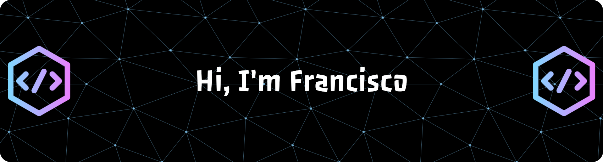

<!--
**fsaavedra0003/fsaavedra0003** is a ✨ _special_ ✨ repository because its `README.md` (this file) appears on your GitHub profile.

Here are some ideas to get you started:

- 🔭 I’m currently working on ...
- 🌱 I’m currently learning ...
- 👯 I’m looking to collaborate on ...
- 🤔 I’m looking for help with ...
- 💬 Ask me about ...
- 📫 How to reach me: ...
- 😄 Pronouns: ...
- ⚡ Fun fact: ...
-->

# 👋 Hi, I'm Francisco Saavedra

🎯 **AI/ML & Big Data Engineer** | 8+ years of experience in **data systems, applied AI, and LLM-powered applications**.  
🌱 Focused on **Agentic AI systems, LLMs, RAG pipelines, and MLOps**.  

---

## 🚀 About Me
- 🤖 I specialize in **AI/ML engineering**, with a focus on **LLMs, agentic systems, and RAG pipelines**  
- 🧠 Experienced in building **end-to-end ML workflows** — from data preprocessing and feature engineering to model training, evaluation, and deployment  
- 📚 Passionate about **transformer-based models, semantic search, and applied NLP** using Hugging Face, OpenAI, and LangChain  
- ⚙️ Skilled in **MLOps for production AI** (Docker, CI/CD, monitoring, and scalable serving)  
- 🔬 Recent MSc in **Computer Science (AI & Big Data)** — thesis on integrating IoT sensor data with LLMs for real-time intelligence  

---

## 🛠️ Tech Stack

**AI / LLMs:**  

**ML / DL:**  

**MLOps & Data:**  

**Cloud & Apps:**  

---

## 🔥 Featured Projects
📌 Curated list of my best repositories (check pinned repos for more):

- **[AI Trading Bot](https://github.com/fsaavedra0003/Agentic-AI-Trading-Bot-with-LLM-reasoning-sentiment-analysis)**  
  🧑‍💻 Agentic trading system with LLM reasoning, sentiment analysis, and backtesting dashboard  

---

⭐️ _Always open to collaborating on AI/ML projects, startups, and research in applied LLMs._

